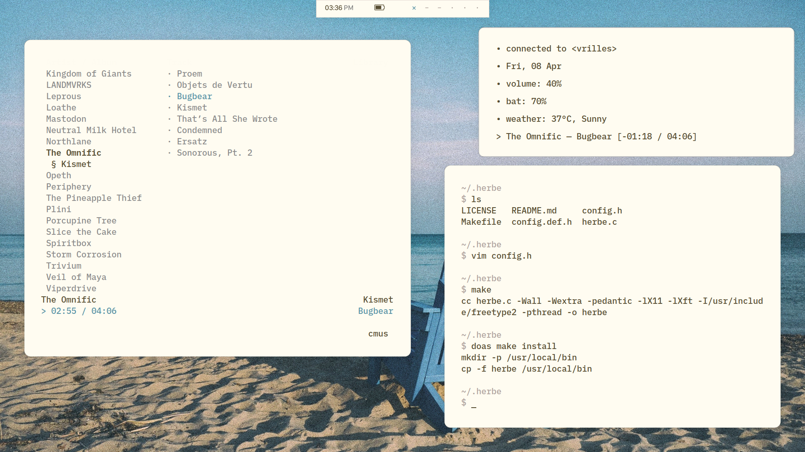

## Tools
- wm: [berry](https://github.com/jlervin/berry)
- multiplexer: [tmux](https://github.com/tmux/tmux)
- terminal emulator: [urxvt](https://linux.die.net/man/1/urxvt)
- editor: [neovim](https://neovim.io)
- image viewer: [feh](https://feh.finalrewind.org/)
- irc client: [weechat](https://weechat.org/)
- music player: [cmus](https://cmus.github.io/)
- media player: [mpv](https://mpv.io/)
- notification daemon: [herbe](https://github.com/dudik/herbe), [dunst](https://github.com/dunst-project/dunst)
